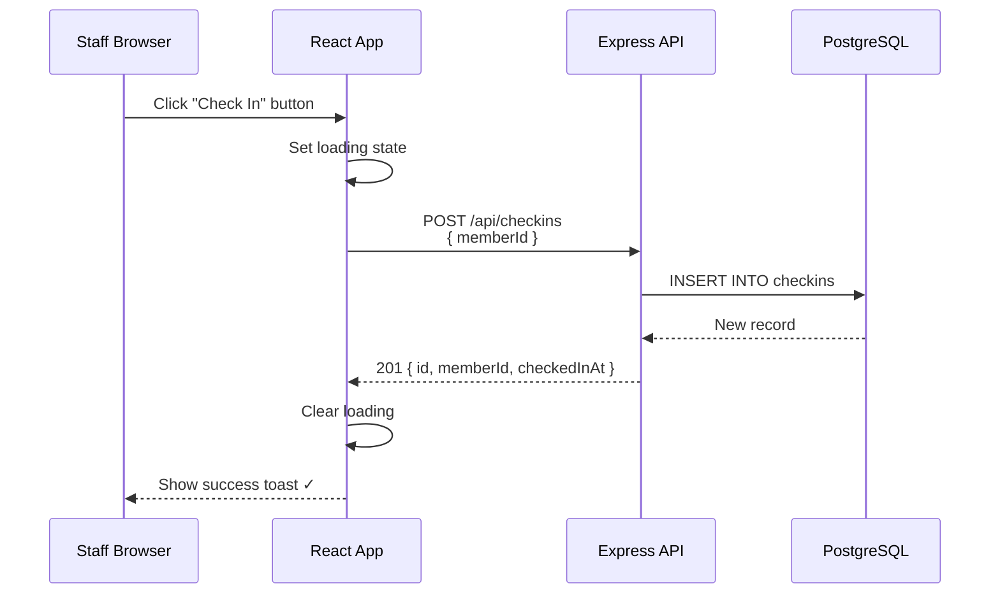
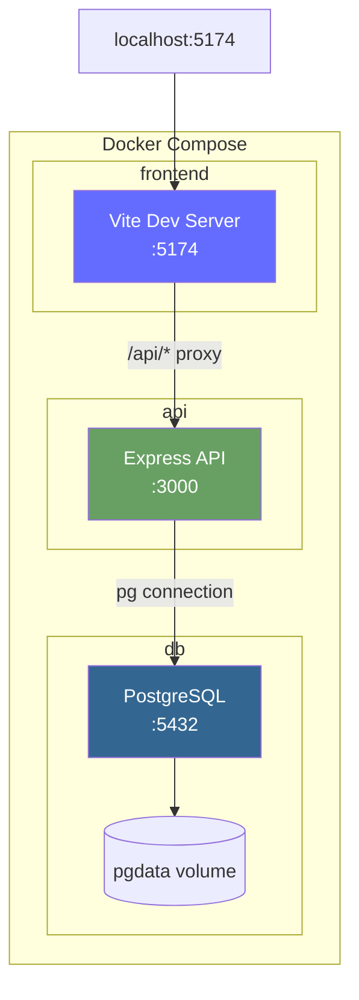
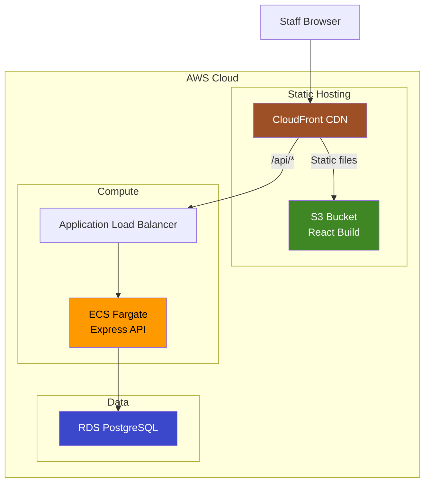

# Member Management MVP - Architecture Document

## Overview

An internal member-management tool for fitness business staff. Designed as an MVP with minimal complexity.

**Constraints:**
- 🏢 **Scope:** Internal staff tool only
- 🔓 **Auth:** None required (MVP)
- ✅ **Check-in:** Simple button click

**Stack:**
| Layer | Technology |
|-------|------------|
| Frontend | React + Vite + TypeScript |
| Backend | Node.js + Express + TypeScript |
| Database | PostgreSQL |
| Local Dev | Docker Compose |
| Target Cloud | AWS (S3, ECS, RDS) |

---

## Member Check-in Data Flow

### Flow Description

Staff clicks "Check In" button → Record saved to database.

```
1. BUTTON CLICK
   └── Staff clicks "Check In" on member's row in the UI

2. REACT STATE
   └── onClick handler calls checkinMember(memberId)
   └── Sets loading state on button

3. API REQUEST
   └── POST /api/checkins
   └── Body: { memberId: "uuid-123" }
   └── No auth headers (MVP)

4. EXPRESS ROUTE
   └── Router receives POST /api/checkins
   └── Extracts memberId from request body

5. SERVICE LAYER
   └── CheckinService.create(memberId)
   └── Validates member exists
   └── Validates membership is active (endDate >= CURRENT_DATE)
   └── Creates timestamp

6. DATABASE INSERT
   └── INSERT INTO checkins (id, member_id, checked_in_at)
   └── VALUES (gen_random_uuid(), $1, NOW())
   └── Returns created record

7. RESPONSE
   └── 201 Created → { id, memberId, checkedInAt }
   └── React clears loading, shows success toast
```

### Sequence Diagram



---

## Solution Diagrams

### Local Development (Docker Compose)



**docker-compose.yml structure:**
```yaml
services:
  frontend:    # Vite + React
    ports: ["5174:5174"]
    depends_on: [api]
    
  api:         # Express + TypeScript
    ports: ["3000:3000"]
    depends_on: [db]
    environment:
      DATABASE_URL: postgresql://postgres:postgres@db:5432/memberapp
    
  db:          # PostgreSQL
    ports: ["5432:5432"]
    volumes: [pgdata:/var/lib/postgresql/data]
```

---

### Theoretical AWS Deployment



**Deployment Mapping:**

| Local | AWS | Purpose |
|-------|-----|---------|
| Vite container | S3 + CloudFront | Serve React app |
| Express container | ECS Fargate | Run API |
| PostgreSQL container | RDS PostgreSQL | Store data |
| Docker network | VPC | Network isolation |

---

## Additional Documentation

For detailed technical specifications including database schema, business rules, validation rules, concurrency control, and future improvements, see [TECH_SPEC.md](file:///Users/amanganello/Documents/Membership%20Managment%20app/TECH_SPEC.md).

---

*Document Version: 1.0 | Updated: 2026-01-28 | Status: MVP Scope*
