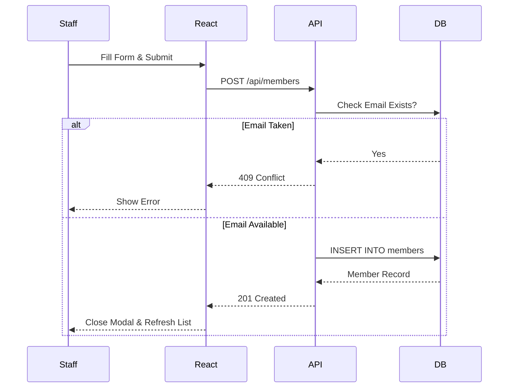
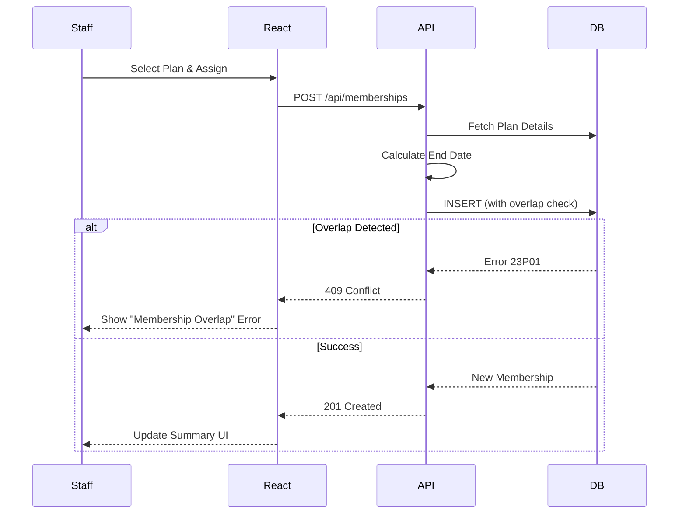
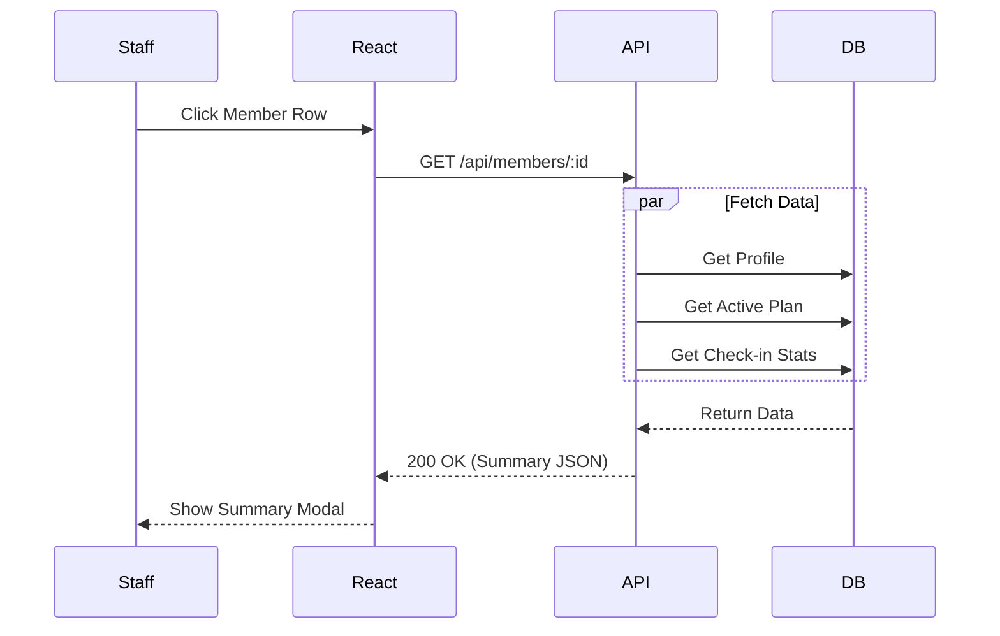
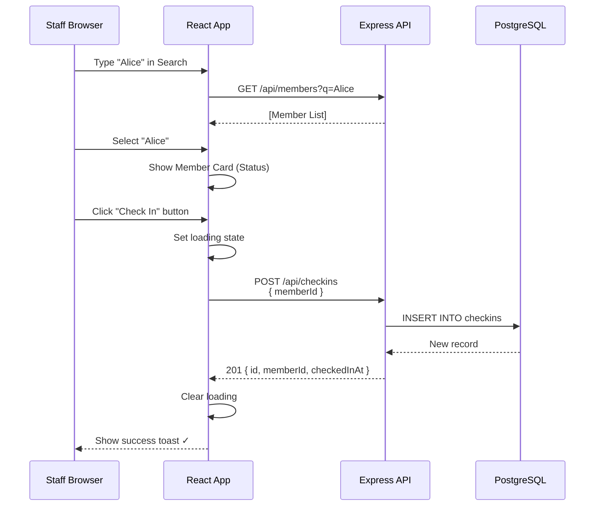
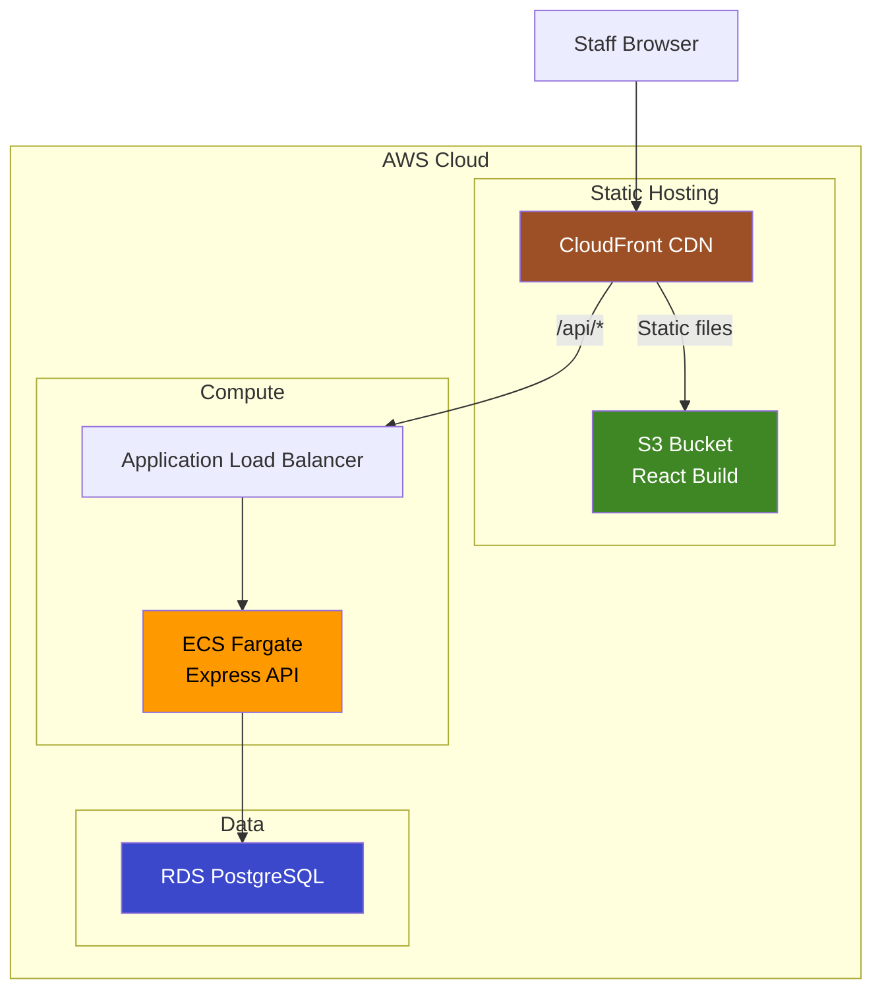

# Member Management MVP - Architecture Document

## Overview

An internal member-management tool for fitness business staff. Designed as an MVP with minimal complexity.

---

## Data Flows

### 1. Add Member Data Flow

Staff clicks "Add Member" → Enters details → Record saved.

```
1. FORM SUBMISSION
   └── Staff fills Name and Email in AddMemberModal
   └── Clicks "Create Member"

2. REACT STATE
   └── onSubmit calls useCreateMember().mutateAsync()
   └── Client-side validation (HTML5 required/email)

3. API REQUEST
   └── POST /api/members
   └── Body: { name: "Alice", email: "alice@example.com" }

4. SERVICE LAYER
   └── memberService.create(data)
   └── Checks email uniqueness (memberRepository.emailExists)
   └── Throws 409 if email exists

5. DATABASE INSERT
   └── INSERT INTO members (name, email)
   └── VALUES ($1, $2) RETURNING id...

6. RESPONSE
   └── 201 Created → { id, name, email ... }
   └── React invalidates 'members' query → Table updates
```



### 2. Assign Membership Data Flow

Staff selects Plan → System calculates End Date → Records active period.

```
1. SELECTION
   └── Staff opens Member Summary → Clicks "Assign Membership"
   └── Selects Plan (e.g., "Monthly Pro") and Start Date

2. REACT STATE
   └── useAssignMembership().mutateAsync({ memberId, planId, startDate })

3. API REQUEST
   └── POST /api/memberships
   └── Body: { memberId: "...", planId: "...", startDate: "2026-02-01" }

4. SERVICE LAYER
   └── membershipService.assign(data)
   └── Fetches Plan details to calculate End Date (e.g., +1 Month)
   └── Validates constraints (Start < End)

5. DATABASE INSERT
   └── INSERT INTO memberships ...
   └── DB Constraint EXCLUDE checks for overlapping dates
   └── Throws 23P01 (409) if overlap found

6. RESPONSE
   └── 201 Created → { id, startDate, endDate ... }
   └── React updates Member Summary UI
```



### 3. View Member Summary Data Flow

Staff clicks Member → System aggregates profile, status, and stats.

```
1. UI ACTION
   └── Staff clicks a member row in MemberTable
   └── React opens MemberSummaryModal

2. REACT HOOK
   └── useMemberSummary(id) calls api.members.getSummary(id)

3. API REQUEST
   └── GET /api/members/:id
   └── Params: { id: "uuid-123" }

4. SERVICE LAYER
   └── memberService.getSummary(id)
   └── FETCHING:
       ├── memberRepository.findById(id)
       ├── membershipRepository.findAllByMemberId(id) → active = membership where start <= today <= end
       └── checkinRepository.getStatsByMemberId(id)

5. RESPONSE_ASSEMBLY
   └── Combines data into MemberSummary object
   └── Returns { id, name, activeMembership, checkinCount30Days ... }

6. UI RENDER
   └── Modal displays Profile, Current Status (Active/Inactive), and Stats
```



### 4. Member Check-in Data Flow

### Flow Description

Staff searches for member → Selects member → Clicks "Check In" → Success Toast.

```
1. SEARCH & SELECT
   └── Staff types name in "Search Member" input
   └── Selects member from autocomplete results
   └── UI shows "Selected Member" card with status

2. CHECK IN CLICK
   └── Staff clicks "Check In" button for selected member

3. REACT STATE
   └── onSubmit handler calls handleCheckin()
   └── Invokes mutation: createCheckin.mutateAsync()
   └── Sets loading state on button

4. API REQUEST
   └── POST /api/checkins
   └── Body: { memberId: "uuid-123" }
   └── No auth headers (MVP)

5. EXPRESS ROUTE
   └── Router receives POST /api/checkins
   └── Extracts memberId from request body

6. SERVICE LAYER
   └── checkinService.recordCheckin(data) with data.memberId
   └── Validates member exists
   └── Validates membership is active (startDate <= today <= endDate)
   └── Creates timestamp

7. DATABASE INSERT
   └── INSERT INTO checkins (id, member_id, checked_in_at)
   └── VALUES (gen_random_uuid(), $1, NOW())
   └── Returns created record

8. RESPONSE
   └── 201 Created → { id, memberId, checkedInAt }
   └── React clears loading, shows success toast
```

### Sequence Diagram



---

### Theoretical AWS Deployment



**Deployment Mapping:**

| Local | AWS | Purpose |
|-------|-----|---------|
| Vite container | S3 + CloudFront | Serve React app |
| Express container | ECS Fargate | Run API |
| PostgreSQL container | RDS PostgreSQL | Store data |
| Docker network | VPC | Network isolation |

---

*Document Version: 1.1 | Created: 2026-01-28*
