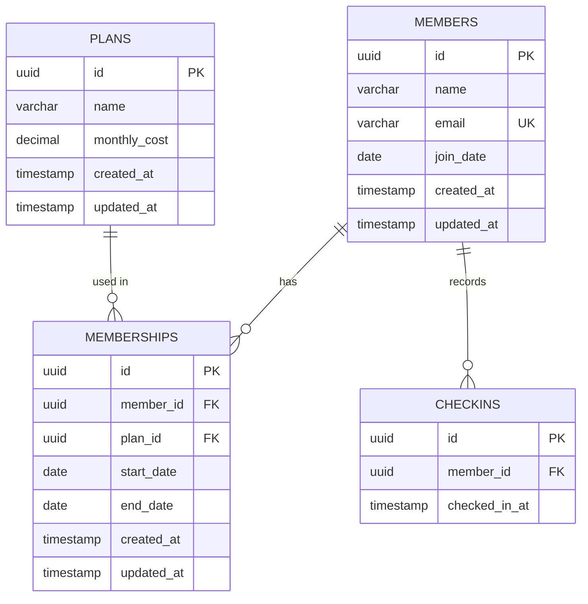

# Technical Specification - Fitness Member Management MVP

## Relational Schema

### Entity Relationship Diagram



### Table Definitions

#### members
| Column | Type | Constraints |
|--------|------|-------------|
| id | UUID | PRIMARY KEY, DEFAULT gen_random_uuid() |
| name | VARCHAR(255) | NOT NULL |
| email | VARCHAR(255) | NOT NULL, UNIQUE |
| join_date | DATE | NOT NULL, DEFAULT CURRENT_DATE |
| created_at | TIMESTAMP WITH TIME ZONE | DEFAULT NOW() |
| updated_at | TIMESTAMP WITH TIME ZONE | DEFAULT NOW() |

**Indexes:**
- `idx_members_email` on `email`

---

#### plans
| Column | Type | Constraints |
|--------|------|-------------|
| id | UUID | PRIMARY KEY, DEFAULT gen_random_uuid() |
| name | VARCHAR(100) | NOT NULL |
| monthly_cost | DECIMAL(10,2) | NOT NULL, CHECK (monthly_cost >= 0) |
| created_at | TIMESTAMP WITH TIME ZONE | DEFAULT NOW() |
| updated_at | TIMESTAMP WITH TIME ZONE | DEFAULT NOW() |

---

#### memberships
| Column | Type | Constraints |
|--------|------|-------------|
| id | UUID | PRIMARY KEY, DEFAULT gen_random_uuid() |
| member_id | UUID | NOT NULL, REFERENCES members(id) ON DELETE CASCADE |
| plan_id | UUID | NOT NULL, REFERENCES plans(id) ON DELETE RESTRICT |
| start_date | DATE | NOT NULL |
| end_date | DATE | NOT NULL |
| created_at | TIMESTAMP WITH TIME ZONE | DEFAULT NOW() |
| updated_at | TIMESTAMP WITH TIME ZONE | DEFAULT NOW() |

**Constraints:**
- `valid_date_range`: CHECK (start_date <= end_date)
- `no_overlapping_memberships`: EXCLUSION constraint (see Concurrency Control below)

**Indexes:**
- `idx_memberships_member_id` on `member_id`
- `idx_memberships_dates` on `(start_date, end_date)`

---

#### checkins
| Column | Type | Constraints |
|--------|------|-------------|
| id | UUID | PRIMARY KEY, DEFAULT gen_random_uuid() |
| member_id | UUID | NOT NULL, REFERENCES members(id) ON DELETE CASCADE |
| checked_in_at | TIMESTAMP WITH TIME ZONE | NOT NULL, DEFAULT NOW() |

**Indexes:**
- `idx_checkins_member_id` on `member_id`
- `idx_checkins_timestamp` on `checked_in_at`

---

### Database Features

**Extension Required:**
```sql
CREATE EXTENSION IF NOT EXISTS btree_gist;
```

**Auto-Update Triggers:**
PostgreSQL does not auto-update `updated_at` columns. A trigger function handles this:

```sql
CREATE OR REPLACE FUNCTION update_modified_column()
RETURNS TRIGGER AS $$
BEGIN
    NEW.updated_at = NOW();
    RETURN NEW;
END;
$$ LANGUAGE 'plpgsql';

-- Applied to: members, plans, memberships
```

**Helper View:**
```sql
CREATE VIEW active_memberships AS
SELECT 
    m.id AS membership_id,
    m.member_id,
    mb.name AS member_name,
    p.name AS plan_name,
    m.start_date,
    m.end_date
FROM memberships m
JOIN members mb ON m.member_id = mb.id
JOIN plans p ON m.plan_id = p.id
WHERE m.end_date >= CURRENT_DATE;
```

---

## Business Rules

### 1. Active Membership Definition
A membership is considered **active** if and only if:
```
end_date >= CURRENT_DATE
```

This allows memberships expiring today to remain valid for check-in.

---

### 2. One Active Membership Rule
**Rule:** A member can have **at most one active membership** at any given time.

**Enforcement:** Database-level exclusion constraint (see Concurrency Control section).

**Impact:**
- When assigning a new membership, ensure no date overlap with existing memberships
- System will reject overlapping assignments with a 409 Conflict error

---

### 3. Check-in Authorization
**Rule:** Only members with an **active membership** can check in.

**Validation Logic:**
```sql
-- Service layer checks:
SELECT COUNT(*) FROM memberships
WHERE member_id = $1
AND end_date >= CURRENT_DATE;

-- If count = 0, reject check-in
```

**Error Response:** `400 Bad Request - Member does not have an active membership`

---

### 4. Membership Cancellation
**Approach:** When a membership is cancelled, the system updates `end_date` to the cancellation date.

**Example:**
```
Original: start_date = 2026-01-01, end_date = 2026-12-31
Cancelled on 2026-06-15:
Updated: start_date = 2026-01-01, end_date = 2026-06-15
```

**Effect:** Membership becomes inactive the next day (2026-06-16), preventing further check-ins.

---

## Validation Rules

### Member Creation
| Field | Validation |
|-------|------------|
| name | Required, 1-255 characters |
| email | Required, valid email format, unique |

### Membership Assignment
| Field | Validation |
|-------|------------|
| member_id | Required, must exist in `members` table |
| plan_id | Required, must exist in `plans` table |
| start_date | Required, valid date |
| end_date | Required, valid date, must be >= start_date |

**Additional checks:**
- No overlapping date range with existing memberships for the same member (enforced by exclusion constraint)

### Check-in
| Field | Validation |
|-------|------------|
| member_id | Required, must exist in `members` table |
| member status | Must have active membership (end_date >= CURRENT_DATE) |

### Plan Details
| Field | Validation |
|-------|------------|
| name | Required, 1-100 characters |
| monthly_cost | Required, numeric, >= 0 |

---

## Concurrency Control

### Problem
**Race Condition:** Two simultaneous requests might attempt to assign overlapping memberships to the same member, violating the "one active membership" rule.

**Example:**
```
Request A: Assign 2026-01-01 to 2026-12-31
Request B: Assign 2026-06-01 to 2027-06-01 (overlaps!)
```

### Solution: PostgreSQL Exclusion Constraint

```sql
CONSTRAINT no_overlapping_memberships 
    EXCLUDE USING gist (
        member_id WITH =,                           -- Same member
        daterange(start_date, end_date, '[]') WITH &&  -- Overlapping dates
    )
```

**How it works:**
1. Uses the GiST index with `btree_gist` extension
2. `member_id WITH =` ensures comparison only happens within the same member
3. `daterange(..., '[]')` creates an inclusive date range from start to end
4. `WITH &&` checks if ranges overlap
5. If overlap detected, PostgreSQL raises error: `23P01 exclusion_violation`

**API Handling:**
```typescript
try {
  await membershipRepository.create(data);
} catch (error) {
  if (error.code === '23P01') {
    throw new ConflictError('Member already has an overlapping membership');
  }
  throw error;
}
```

**Benefits:**
- Database-level enforcement (cannot be bypassed)
- Atomic operation (thread-safe)
- Works even with multiple API instances

---

## "If More Time" Improvements

### 1. 🔐 Staff Authentication
**Priority:** Critical (currently skipped for MVP)

**Why:** Currently no access control; any user can perform any action.

**Implementation:**
- Login page with email/password
- JWT tokens in httpOnly cookies
- Protect all `/api/*` routes with auth middleware
- Add staff roles (Admin, Front Desk)

---

### 2. 📊 Check-in Analytics Dashboard
**Why:** Business value for gym owners to understand usage patterns

**Features:**
- Daily/weekly/monthly check-in trends (line chart)
- Peak hours visualization (bar chart)
- Member visit frequency report
- Exportable CSV reports for external analysis

**Example Query:**
```sql
SELECT DATE(checked_in_at) as date, COUNT(*) as count
FROM checkins 
WHERE checked_in_at >= NOW() - INTERVAL '30 days'
GROUP BY DATE(checked_in_at)
ORDER BY date;
```

---

### 3. 🔔 Member Engagement Notifications
**Why:** Increase retention and re-engage inactive members

**Features:**
- Email/SMS when member hasn't visited in 7+ days
- Welcome notification on first check-in
- Birthday/anniversary messages
- Membership expiration reminders (7, 3, 1 day before)

**Integration:** SendGrid (email) + Twilio (SMS) or AWS SES/SNS

---

### 4. 📱 QR Code Self Check-in
**Why:** Reduce staff workload, enable self-service kiosks

**Implementation:**
- Generate unique QR code per member (encodes member UUID)
- Members scan QR at entrance tablet/kiosk
- API endpoint: `POST /api/checkins/qr`
- Libraries: `qrcode` (generation) + device camera API (scanning)

**Flow:**
1. Member displays QR code (printed card or mobile app)
2. Kiosk scans code
3. System validates → checks active membership → logs check-in
4. Display success/error on screen

---

### 5. 💳 Payment Integration
**Why:** Automate billing and renewals

**Features:**
- Stripe/PayPal integration for recurring payments
- Auto-renewal of memberships before expiration
- Payment history tracking
- Automated receipt generation

---

*Document Version: 1.0 | Created: 2026-01-28*
