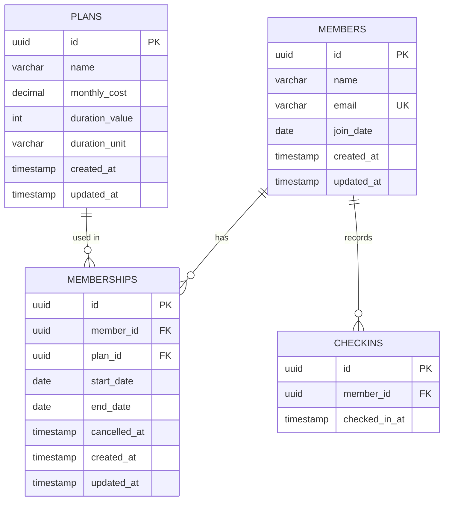

# Technical Specification - Fitness Member Management MVP

## 1. API Interface & Usage

| Method | Endpoint | Action | Payload / Params |
| :--- | :--- | :--- | :--- |
| `GET` | `/members` | List Members | `?q=search` (optional; pagination not implemented) |
| `POST` | `/members` | Create Member | `{ name, email }` |
| `GET` | `/members/:id` | Get Summary | - |
| `GET` | `/plans` | List Plans | - |
| `POST` | `/memberships` | Assign Plan | `{ memberId, planId, startDate }` |
| `PATCH` | `/memberships/:id/cancel` | Cancel | `{ cancelDate }` (YYYY-MM-DD, required) |
| `POST` | `/checkins` | Record Visit | `{ memberId }` |

**Standard Response:** JSON. Errors return `{ error: { code, message, statusCode, requestId? } }`.

### API Examples

**`POST /members`**
- **Request:**
```json
{ "name": "Alice", "email": "alice@example.com" }
```
- **Response (`201 Created`):**
```json
{ "id": "uuid-123", "name": "Alice", "createdAt": "2026-02-01T10:00:00Z" }
```

**`GET /members`**
- **Response (`200 OK`):**
```json
[
  { "id": "uuid-123", "name": "Alice", "email": "alice@example.com", "joinDate": "2026-01-01" }
]
```

**`GET /members/:id`**
- **Response (`200 OK`):**
```json
{
  "id": "uuid-123",
  "name": "Alice",
  "email": "alice@example.com",
  "joinDate": "2026-01-01",
  "activeMembership": { "id": "m-1", "planName": "Pro", "endDate": "2026-12-31" },
  "lastCheckinAt": "2026-02-01T09:00:00Z",
  "checkinCount30Days": 12
}
```

**`GET /plans`**
- **Response (`200 OK`):**
```json
[
  { "id": "p-1", "name": "Monthly Pro", "monthlyCost": "50.00", "durationValue": 1, "durationUnit": "month" }
]
```

**`POST /memberships`**
- **Request:**
```json
{ "memberId": "uuid-123", "planId": "p-1", "startDate": "2026-02-01" }
```
- **Response (`201 Created`):**
```json
{ "id": "m-2", "memberId": "uuid-123", "startDate": "2026-02-01", "endDate": "2026-03-01" }
```

**`PATCH /memberships/:id/cancel`**
- **Request (body required):**
```json
{ "cancelDate": "2026-02-01" }
```
- **Response (`200 OK`):**
```json
{ "id": "m-2", "memberId": "uuid-123", "planId": "p-1", "startDate": "2026-02-01", "endDate": "2026-03-01", "cancelledAt": "2026-02-01T14:12:00Z", "createdAt": "...", "updatedAt": "..." }
```

**`POST /checkins`**
- **Request:**
```json
{ "memberId": "uuid-123" }
```
- **Response (`201 Created`):**
```json
{ "id": "c-1", "memberId": "uuid-123", "checkedInAt": "2026-02-01T14:12:00Z" }
```
- **Error (`400 Bad Request` - No Active Plan):**
```json
{ "error": { "code": "VALIDATION_ERROR", "message": "Member does not have an active membership. Check-in denied.", "statusCode": 400 } }
```

---

## 2. Relational Schema & Architecture

### Entity Relationship Diagram


### Database Constraints & Indexes
-   **Email Uniqueness**: `idx_members_email` on `members(email)`.
-   **Date Integrity**: `CHECK (start_date <= end_date)`.
-   **Exclusion Constraint**: `EXCLUDE USING gist (member_id WITH =, daterange(start_date, end_date, '[]') WITH &&)`. Prevents overlapping memberships.

---

## 3. Business & Validation Rules

1.  **Active Membership Definition**: `start_date <= CURRENT_DATE AND end_date >= CURRENT_DATE`.
2.  **One Active Membership Rule**: Enforced by Database-level exclusion constraint.
3.  **Check-in Authorization**: Only members with an active membership can check in.
4.  **Delayed Cancellation**: Sets `cancelled_at` but does NOT change `end_date`. Member retains access until paid period ends. `cancelled_at` represents the date the cancellation was scheduled/requested; access remains valid until `end_date`.
5.  **Validation Rules**:
    -   **Member**: Valid email format; name 1-255 characters.
    -   **Plans**: `monthly_cost >= 0`; `duration_unit` in (day, month, year).
    -   **Assignments**: `start_date` must be valid; cannot overlap existing memberships.

---

## 4. Concurrency Control (Race Conditions)

To prevent double-assignment or overlapping memberships if two staff members click "Assign" simultaneously, we use a PostgreSQL **Exclusion Constraint**.  
-   This ensures atomicity at the database level.
-   Requests that violate the range check are rejected with a `409 Conflict` (Backend maps DB error `23P01`).

---

## 5. Roadmap ("If More Time")

-   **Frontend Performance**: Usage of `useCallback`, `useMemo`, and `React.memo` to prevent unnecessary re-renders; virtualization of the members list (e.g. `@tanstack/react-virtual`) for large datasets to keep scroll and render cost constant.
-   **Security Hardening**: Strict CORS policies to restrict origins and Header security (Helmet).
-   **Backend Resilience**: Rate limiting (DoS protection) and optimized Database Connection Pooling.
-   **Comprehensive Testing Strategy**: Unit (Jest), Integration (Supertest), and E2E (Playwright) coverage to ensure system stability.
-   **API Documentation**: Automated OpenAPI/Swagger generation for type-safe client consumption.
-   **Observability**: Centralized logging (Pino) and error tracking (Sentry).
