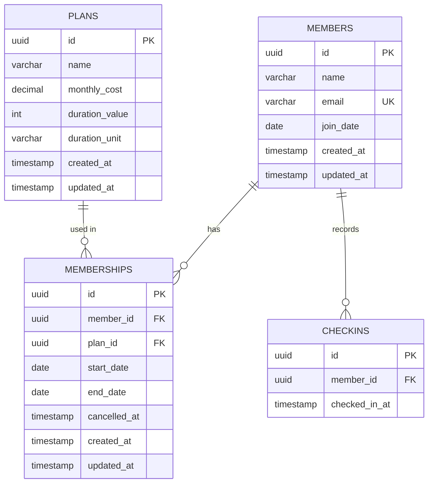

# Technical Specification - Fitness Member Management MVP

## 1. API Interface & Usage

| Method | Endpoint | Action | Payload / Params |
| :--- | :--- | :--- | :--- |
| `GET` | `/members` | List Members | `?q=search` (optional; pagination not implemented) |
| `POST` | `/members` | Create Member | `{ name, email }` |
| `GET` | `/members/:id` | Get Summary | - |
| `GET` | `/plans` | List Plans | - |
| `POST` | `/memberships` | Assign Plan | `{ memberId, planId, startDate }` |
| `PATCH` | `/memberships/:id/cancel` | Cancel | `{ cancelDate }` (YYYY-MM-DD, required) |
| `POST` | `/checkins` | Record Visit | `{ memberId }` |

**Standard Response:** JSON. Errors return `{ error: { code, message, statusCode, requestId? } }`.

### API Examples

**`POST /members`**
- **Request:**
```json
{ "name": "Alice", "email": "alice@example.com" }
```
- **Response (`201 Created`):**
```json
{ "id": "uuid-123", "name": "Alice", "createdAt": "2026-02-01T10:00:00Z" }
```

**`GET /members`**
- **Response (`200 OK`):**
```json
[
  { "id": "uuid-123", "name": "Alice", "email": "alice@example.com", "joinDate": "2026-01-01" }
]
```

**`GET /members/:id`**
- **Response (`200 OK`):**
```json
{
  "id": "uuid-123",
  "name": "Alice",
  "email": "alice@example.com",
  "joinDate": "2026-01-01",
  "activeMembership": { "id": "m-1", "planName": "Pro", "endDate": "2026-12-31" },
  "lastCheckinAt": "2026-02-01T09:00:00Z",
  "checkinCount30Days": 12
}
```

**`GET /plans`**
- **Response (`200 OK`):**
```json
[
  { "id": "p-1", "name": "Monthly Pro", "monthlyCost": "50.00", "durationValue": 1, "durationUnit": "month" }
]
```

**`POST /memberships`**
- **Request:**
```json
{ "memberId": "uuid-123", "planId": "p-1", "startDate": "2026-02-01" }
```
- **Response (`201 Created`):**
```json
{ "id": "m-2", "memberId": "uuid-123", "startDate": "2026-02-01", "endDate": "2026-03-01" }
```

**`PATCH /memberships/:id/cancel`**
- **Request (body required):**
```json
{ "cancelDate": "2026-02-01" }
```
- **Response (`200 OK`):**
```json
{ "id": "m-2", "memberId": "uuid-123", "planId": "p-1", "startDate": "2026-02-01", "endDate": "2026-03-01", "cancelledAt": "2026-02-01T14:12:00Z", "createdAt": "...", "updatedAt": "..." }
```

**`POST /checkins`**
- **Request:**
```json
{ "memberId": "uuid-123" }
```
- **Response (`201 Created`):**
```json
{ "id": "c-1", "memberId": "uuid-123", "checkedInAt": "2026-02-01T14:12:00Z" }
```
- **Error (`400 Bad Request` - No Active Plan):**
```json
{ "error": { "code": "VALIDATION_ERROR", "message": "Member does not have an active membership. Check-in denied.", "statusCode": 400 } }
```

---

## 2. Relational Schema & Architecture

### Entity Relationship Diagram

```mermaid
erDiagram
    MEMBERS ||--o{ MEMBERSHIPS : has
    PLANS ||--o{ MEMBERSHIPS : "used in"
    MEMBERS ||--o{ CHECKINS : records
    
    MEMBERS {
        uuid id PK
        varchar name
        varchar email UK
        date join_date
        timestamp created_at
        timestamp updated_at
    }
    
    PLANS {
        uuid id PK
        varchar name
        decimal monthly_cost
        int duration_value
        varchar duration_unit
        timestamp created_at
        timestamp updated_at
    }
    
    MEMBERSHIPS {
        uuid id PK
        uuid member_id FK
        uuid plan_id FK
        date start_date
        date end_date
        timestamp cancelled_at
        timestamp created_at
        timestamp updated_at
    }
    
    CHECKINS {
        uuid id PK
        uuid member_id FK
        timestamp checked_in_at
    }
```

### Database Constraints & Indexes
-   **Email Uniqueness**: `idx_members_email` on `members(email)`.
-   **Date Integrity**: `CHECK (start_date <= end_date)`.
-   **Exclusion Constraint**: `EXCLUDE USING gist (member_id WITH =, daterange(start_date, end_date, '[]') WITH &&)`. Prevents overlapping memberships.

---

## 3. Business & Validation Rules

1.  **Active Membership Definition**: `start_date <= CURRENT_DATE AND end_date >= CURRENT_DATE`.
2.  **One Active Membership Rule**: Enforced by Database-level exclusion constraint.
3.  **Check-in Authorization**: Only members with an active membership can check in.
4.  **Delayed Cancellation**: Sets `cancelled_at` but does NOT change `end_date`. Member retains access until paid period ends. `cancelled_at` represents the date the cancellation was scheduled/requested; access remains valid until `end_date`.
5.  **Validation Rules**:
    -   **Member**: Valid email format; name 1-255 characters.
    -   **Plans**: `monthly_cost >= 0`; `duration_unit` in (day, month, year).
    -   **Assignments**: `start_date` must be valid; cannot overlap existing memberships.

---

## 4. Concurrency Control (Race Conditions)

To prevent double-assignment or overlapping memberships if two staff members click "Assign" simultaneously, we use a PostgreSQL **Exclusion Constraint**.  
-   This ensures atomicity at the database level.
-   Requests that violate the range check are rejected with a `409 Conflict` (Backend maps DB error `23P01`).

---

## 5. Roadmap ("If More Time")

-   **Frontend**:
    -   *Route-Level Error Boundaries*: One `<ErrorBoundary>` wraps the entire `<App />`. If any route throws a render error, the entire application is replaced by the fallback — the user cannot navigate to other, unaffected pages. Route-level error boundaries (via React Router's `errorElement` or per-route `<ErrorBoundary>` wrappers) would isolate failures.
    -   *Performance*: Usage of `useCallback`, `useMemo`, and `React.memo` to prevent unnecessary re-renders; virtualization of the members list (e.g. `@tanstack/react-virtual`) for large datasets to keep scroll and render cost constant.
    -   *Optimistic Updates (TanStack Query)*: Implement the `onMutate` / rollback / `onSettled` pattern for check-in mutations to provide instant UI feedback. Check-ins are high-frequency, low-risk actions where perceived latency matters most.
-   **Security Hardening**: Strict CORS policies to restrict origins and Header security (Helmet).
-   **Backend Resilience**:
    -   *Connection Pooling*: For multi-instance deployments, introduce PgBouncer as an external connection pooler to consolidate backend connections.
    -   *Pagination on Members List*: `GET /members` returns every record in a single response. For any dataset beyond a few hundred members this will degrade API response time, memory usage, and frontend render cost. Cursor-based (keyset) pagination using `id` or `join_date` is the recommended approach to avoid offset-drift and enable efficient scrolling.
    -   *Rate Limiting*: The API has zero rate-limiting middleware. The `POST /checkins` endpoint is especially vulnerable as the highest-frequency, publicly-facing action. A library such as `express-rate-limit` with per-IP or per-member sliding windows should be introduced.
    -   *Transactions for Membership Assignment*: The `assign` flow (validate member → fetch plan → insert membership) runs as individual queries without a wrapping `BEGIN`/`COMMIT`. While the PostgreSQL exclusion constraint catches overlapping date ranges, the check-then-insert pattern has a TOCTOU window where other invariants (member existence, plan state) are not atomically guaranteed. The validation + insert should be wrapped in a database transaction.
-   **Comprehensive Testing Strategy**: Unit (Jest/Vitest), Integration (Supertest), and E2E (Playwright) coverage. Critical E2E flows: add member (form → list update, duplicate email error), assign membership (plan selection → summary update, overlap rejection), and check-in (active member success, inactive member denial).
-   **API Documentation**: Automated OpenAPI/Swagger generation for type-safe client consumption.
-   **Observability**: Centralized log aggregation and error tracking (Sentry). Structured request logging via Pino is already in place.
