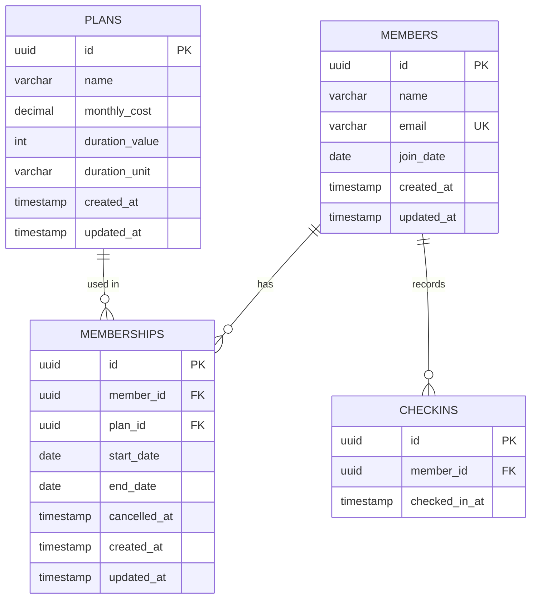

# Technical Specification - Fitness Member Management MVP

## Relational Schema

### Entity Relationship Diagram



### Table Definitions

#### members
| Column | Type | Constraints |
|--------|------|-------------|
| id | UUID | PRIMARY KEY, DEFAULT gen_random_uuid() |
| name | VARCHAR(255) | NOT NULL |
| email | VARCHAR(255) | NOT NULL, UNIQUE |
| join_date | DATE | NOT NULL, DEFAULT CURRENT_DATE |
| created_at | TIMESTAMP WITH TIME ZONE | DEFAULT NOW() |
| updated_at | TIMESTAMP WITH TIME ZONE | DEFAULT NOW() |

**Indexes:**
- `idx_members_email` on `email`

---

#### plans
| Column | Type | Constraints |
|--------|------|-------------|
| id | UUID | PRIMARY KEY, DEFAULT gen_random_uuid() |
| name | VARCHAR(100) | NOT NULL |
| monthly_cost | DECIMAL(10,2) | NOT NULL, CHECK (monthly_cost >= 0) |
| duration_value | INTEGER | NOT NULL, DEFAULT 1 |
| duration_unit | VARCHAR(20) | NOT NULL, CHECK (duration_unit IN ('day', 'month', 'year')) |
| created_at | TIMESTAMP WITH TIME ZONE | DEFAULT NOW() |
| updated_at | TIMESTAMP WITH TIME ZONE | DEFAULT NOW() |

---

#### memberships
| Column | Type | Constraints |
|--------|------|-------------|
| id | UUID | PRIMARY KEY, DEFAULT gen_random_uuid() |
| member_id | UUID | NOT NULL, REFERENCES members(id) ON DELETE CASCADE |
| plan_id | UUID | NOT NULL, REFERENCES plans(id) ON DELETE RESTRICT |
| start_date | DATE | NOT NULL |
| end_date | DATE | NOT NULL |
| cancelled_at | TIMESTAMP WITH TIME ZONE | DEFAULT NULL |
| created_at | TIMESTAMP WITH TIME ZONE | DEFAULT NOW() |
| updated_at | TIMESTAMP WITH TIME ZONE | DEFAULT NOW() |

**Constraints:**
- `valid_date_range`: CHECK (start_date <= end_date)
- `no_overlapping_memberships`: EXCLUSION constraint (see Concurrency Control below)

**Indexes:**
- `idx_memberships_member_id` on `member_id`
- `idx_memberships_dates` on `(start_date, end_date)`

---

#### checkins
| Column | Type | Constraints |
|--------|------|-------------|
| id | UUID | PRIMARY KEY, DEFAULT gen_random_uuid() |
| member_id | UUID | NOT NULL, REFERENCES members(id) ON DELETE CASCADE |
| checked_in_at | TIMESTAMP WITH TIME ZONE | NOT NULL, DEFAULT NOW() |

**Indexes:**
- `idx_checkins_member_id` on `member_id`
- `idx_checkins_timestamp` on `checked_in_at`

---

### Database Features

**Extension Required:**
```sql
CREATE EXTENSION IF NOT EXISTS btree_gist;
```

**Auto-Update Triggers:**
PostgreSQL does not auto-update `updated_at` columns. A trigger function handles this:

```sql
CREATE OR REPLACE FUNCTION update_modified_column()
RETURNS TRIGGER AS $$
BEGIN
    NEW.updated_at = NOW();
    RETURN NEW;
END;
$$ LANGUAGE 'plpgsql';

CREATE TRIGGER update_members_modtime BEFORE UPDATE ON members FOR EACH ROW EXECUTE PROCEDURE update_modified_column();
CREATE TRIGGER update_plans_modtime BEFORE UPDATE ON plans FOR EACH ROW EXECUTE PROCEDURE update_modified_column();
CREATE TRIGGER update_memberships_modtime BEFORE UPDATE ON memberships FOR EACH ROW EXECUTE PROCEDURE update_modified_column();

```

**Helper View:**
```sql
CREATE VIEW active_memberships AS
SELECT 
    m.id AS membership_id,
    m.member_id,
    mb.name AS member_name,
    p.name AS plan_name,
    m.start_date,
    m.end_date
FROM memberships m
JOIN members mb ON m.member_id = mb.id
JOIN plans p ON m.plan_id = p.id
WHERE m.end_date >= CURRENT_DATE;
```

---

## API Interface

| Method | Endpoint | Action | Payload / Params |
| :--- | :--- | :--- | :--- |
| `GET` | `/health` | Server Check | - |
| `GET` | `/members` | List Members | `?q=search`, `?page=1` |
| `POST` | `/members` | Create Member | `{ name, email }` |
| `GET` | `/members/:id` | Get Summary | - |
| `GET` | `/plans` | List Plans | - |
| `POST` | `/memberships` | Assign Plan | `{ memberId, planId, startDate }` |
| `PATCH` | `/memberships/:id/cancel` | Cancel | - |
| `POST` | `/checkins` | Record Visit | `{ memberId }` |

**Standard Response:** JSON. Errors return `{ error: { code, message } }`.

### Representative Examples

**Request (`POST /members`):**
```json
{ "name": "Alice", "email": "alice@example.com" }
```
**Response (`201 Created`):**
```json
{ "id": "uuid...", "name": "Alice", "createdAt": "2026-01-01..." }
```

**Request (`POST /checkins`):**
```json
{ "memberId": "uuid..." }
```
**Response (`400 Bad Request`):**
```json
{ "error": { "code": "VALIDATION_ERROR", "message": "No active membership" } }
```

---

## Business Rules

### 1. Active Membership Definition
A membership is considered **active** if and only if:
```
start_date <= CURRENT_DATE AND end_date >= CURRENT_DATE
```

This allows memberships expiring today to remain valid for check-in.

---

### 2. One Active Membership Rule
**Rule:** A member can have **at most one active membership** at any given time.

**Enforcement:** Database-level exclusion constraint (see Concurrency Control section).

**Impact:**
- When assigning a new membership, ensure no date overlap with existing memberships
- System will reject overlapping assignments with a 409 Conflict error

---

### 3. Check-in Authorization
**Rule:** Only members with an **active membership** can check in.

**Validation Logic:**
```sql
-- Service layer checks:
SELECT COUNT(*) FROM memberships
WHERE member_id = $1
AND start_date <= CURRENT_DATE
AND end_date >= CURRENT_DATE;

-- If count = 0, reject check-in
```

**Error Response:** `400 Bad Request - Member does not have an active membership`

---

### 4. Membership Cancellation
**Approach:** "Cancel at Period End" (Delayed Cancellation).
When a membership is cancelled, the system records the timestamp in `cancelled_at` but **does NOT** change the `end_date`.

**Example:**
```
Original: start_date = 2026-01-01, end_date = 2026-12-31
Cancelled on 2026-06-15:
Updated: cancelled_at = 2026-06-15, end_date = 2026-12-31 (Unchanged)
```

**Effect:**
- The member remains **Active** and can check in until `end_date`.
- The UI displays "Scheduled to Cancel" and prevents manual renewal until expired.
- Prevents "early termination" refunds or loss of paid access.

---

## Validation Rules

### Member Creation
| Field | Validation |
|-------|------------|
| name | Required, 1-255 characters |
| email | Required, valid email format, unique |

### Membership Assignment
| Field | Validation |
|-------|------------|
| member_id | Required, must exist in `members` table |
| plan_id | Required, must exist in `plans` table |
| start_date | Required, valid date |
| end_date | Required, valid date, must be >= start_date |

**Additional checks:**
- No overlapping date range with existing memberships for the same member (enforced by exclusion constraint)

### Check-in
| Field | Validation |
|-------|------------|
| member_id | Required, must exist in `members` table |
| member status | Must have active membership (end_date >= CURRENT_DATE) |

### Plan Details
| Field | Validation |
|-------|------------|
| name | Required, 1-100 characters |
| monthly_cost | Required, numeric, >= 0 |

---

## Concurrency Control

### Problem
**Race Condition:** Two simultaneous requests might attempt to assign overlapping memberships to the same member, violating the "one active membership" rule.

**Example:**
```
Request A: Assign 2026-01-01 to 2026-12-31
Request B: Assign 2026-06-01 to 2027-06-01 (overlaps!)
```

### Solution: PostgreSQL Exclusion Constraint

```sql
CONSTRAINT no_overlapping_memberships 
    EXCLUDE USING gist (
        member_id WITH =,                           -- Same member
        daterange(start_date, end_date, '[]') WITH &&  -- Overlapping dates
    )
```

**How it works:**
1. Uses the GiST index with `btree_gist` extension
2. `member_id WITH =` ensures comparison only happens within the same member
3. `daterange(..., '[]')` creates an inclusive date range from start to end
4. `WITH &&` checks if ranges overlap
5. If overlap detected, PostgreSQL raises error: `23P01 exclusion_violation`

**API Handling:**
```typescript
try {
  await membershipRepository.create(data);
} catch (error) {
  if (error.code === '23P01') {
    throw new ConflictError('Member already has an overlapping membership');
  }
  throw error;
}
```

**Benefits:**
- Database-level enforcement (cannot be bypassed)
- Atomic operation (thread-safe)
- Works even with multiple API instances

---

## "If More Time" Improvements

### 1. 📄 Scalable Pagination (Keyset/Cursor-based)
**Why:** Critical performance stability as datasets grow to millions of records. Standard "Offset" pagination degrades linearly (`O(N)`).

**Implementation:**
- **Method:** Keyset Pagination (Seek Method).
- **Benefit:** Constant time `O(1)` database performance regardless of page depth.

---

### 2. 🧪 Comprehensive Testing Strategy
**Why:** Ensure system stability and prevent regressions.
**Implementation:**
- Unit tests for all Services and Repositories (Jest).
- Integration tests for API endpoints (Supertest).
- E2E tests for critical user flows (Playwright/Cypress).

---

### 3. 🚀 CI/CD Pipeline
**Why:** Automate quality checks and deployment.
**Implementation:**
- GitHub Actions workflow for Lint + Test + Build.
- Pre-commit hooks (Husky) for code quality.
- Automated database migration application.

---

### 4. 📝 API Documentation (OpenAPI)
**Why:** Standardize API consumption and enable client generation.
**Implementation:**
- Auto-generate Swagger/OpenAPI spec from validation schemas.
- Interactive API playground (Swagger UI).
- Automated TypeScript client generation for frontend.

---

### 5. 🔍 Monitoring & Observability
**Why:** Proactive error detection and performance tuning.
**Implementation:**
- Structured logging (Pino) with request correlation IDs.
- Centralized error tracking (e.g., Sentry).
- Health checks with deep database connectivity validation.

---

### 6. 🔮 Future Product Features
**Why:** Business value expansion.
**Planned Features:**
- **Authentication:** Staff login, JWT tokens, RBAC.
- **Analytics:** Dashboard for check-in trends and peak hours.
- **Engagement:** Automated emails for missed visits or renewals.
- **QR Check-in:** Self-service kiosk mode.
- **Payments:** Stripe integration for recurring billing.


*Document Version: 1.0 | Created: 2026-01-28*
